# ADR-002: Google Video Intelligence API Integration for Enhanced Video Classification

## Status
Accepted

## Date
2024-12-19

## Context
The Editora v2 platform currently uses basic local algorithms for video scene detection and classification. While functional, these algorithms have limitations in accuracy and sophistication compared to Google's machine learning models. With Google Video Intelligence API enabled in our account and existing Google Cloud infrastructure, we have an opportunity to significantly enhance our video classification capabilities.

### Current Limitations
1. **Basic Scene Detection**: Local algorithms provide rudimentary scene detection with limited accuracy
2. **No Temporal Context**: Current approach lacks understanding of video content over time
3. **Limited Label Recognition**: Local classification cannot match Google's extensive label vocabulary
4. **Manual Keyframe Selection**: Simple position-based keyframe extraction without content awareness

### Available Resources
- ✅ Google Video Intelligence API enabled
- ✅ Google Cloud service account with proper permissions
- ✅ Existing Google Vision API integration for images
- ✅ Established video processing pipeline
- ✅ ADR-001 storage conventions for consistent asset organization

## Decision
We will integrate Google Video Intelligence API with `LABEL_DETECTION` feature to replace our existing video classification algorithms, combined with our existing Google Vision API for detailed visual analysis of extracted keyframes.

### Optimized Hybrid Classification Pipeline

#### 1. **Google Video Intelligence API Configuration**
- **Feature**: `LABEL_DETECTION` with `SHOT_AND_FRAME_MODE`
- **Model**: `builtin/stable` for consistent results
- **Confidence Thresholds**: 
  - Video confidence: 60% (inclusive for complex scenes)
  - Frame confidence: 70% (balanced for temporal evidence)
- **Shot Detection**: Enabled with `builtin/stable` model for scene boundary detection

#### 2. **Intelligent Label Filtering & Prioritization**
- **Specific Scene Indicators** (Priority 1, ≥60% confidence):
  - `kitchen`, `bedroom`, `bathroom`, `living room`, `dining room`
  - `swimming pool`, `outdoor`, `patio`, `balcony`, `garage`
- **Generic Scene Indicators** (Priority 2, ≥80% confidence):
  - `room`, `interior`, `space`, `area` (only when no specific indicators present)
- **Excluded Generic Labels** (unless ≥95% confidence):
  - `floor`, `property`, `wall`, `flooring`, `furniture`, `table`, `chair`
  - `ceiling`, `tile`, `wood`, `stone`, `countertop`, `cabinet`

#### 3. **Time-Window Scene Consolidation**
- Group labels by 1-second time windows
- **Priority Resolution**: Specific scene indicators override generic ones
- **Example**: When both `swimming pool` and `floor` detected at same timestamp → choose `swimming pool`
- **Temporal Evidence**: Require consistent labeling across time for scene validation

#### 4. **Precision Keyframe Extraction**
- Extract keyframes at **scene midpoints** for top 10 highest-confidence scenes
- Use FFmpeg for precise frame extraction at exact timestamps
- Store following ADR-001: `gs://{bucket}/{user_id}/{project_id}/keyframes/{scene_id}_middle.jpg`
- **Cost Control**: Limit to 10 keyframes per video (~$0.015 per video)

#### 5. **Google Vision API Enhancement**
- Apply Vision API classification to extracted keyframes (≥75% confidence threshold)
- **Exact Match Priority**: Direct room name matches take precedence over indicator matching
- **Example**: Vision API detects `kitchen` → immediately classify as `kitchen` (no secondary analysis)
- Enhanced room mapping with 200+ indicators across 10 room types

#### 6. **Hybrid Classification Rules**
- **Priority 1**: Vision API exact matches (kitchen → kitchen, bathroom → bathroom)
- **Priority 2**: Video Intelligence specific scene indicators  
- **Priority 3**: Vision API indicator-based matching
- **Fallback**: Video Intelligence generic scenes (only if scene-related)
- **Scene Merging**: Combine overlapping scenes of same type, prefer specific over generic

### Technical Architecture

```mermaid
graph TD
    A[Video Upload] --> B[Google Video Intelligence API]
    B --> C[Raw Labels + Shot Detection]
    C --> D[Intelligent Label Filtering]
    D --> E[Exclude Generic Labels: floor, property, wall]
    E --> F[Time-Window Consolidation]
    F --> G[Priority Scene Selection: kitchen > room]
    G --> H[Extract Top 10 Scene Keyframes]
    H --> I[Store Keyframes in GCS]
    I --> J[Google Vision API on Keyframes]
    J --> K[Exact Match Priority: kitchen → kitchen]
    K --> L[Hybrid Classification Rules]
    L --> M[Scene Merging & Post-Processing]
    M --> N[Enhanced Scene Classification]
    N --> O[Store in Firestore]
    O --> P[Available for Movie Creation]
```



### Implementation Components

#### 1. **GoogleVideoIntelligenceService**
```python
class GoogleVideoIntelligenceService:
    def analyze_video_scenes(self, video_gs_url: str, config: Dict[str, Any]) -> List[VideoScene]:
        # Optimized configuration: video_confidence=0.6, frame_confidence=0.7
        # SHOT_AND_FRAME_MODE with builtin/stable model
        # Returns scenes with timestamps, labels, and confidence scores
```

#### 2. **Intelligent Label Filtering**
```python
def filter_scenes_strict(self, labels: List[Dict[str, Any]]) -> List[Dict[str, Any]]:
    # Priority 1: Specific scene indicators (≥60% confidence)
    # Priority 2: Generic scene indicators (≥80% confidence, not excluded)  
    # Excluded: floor, property, wall, furniture, table (unless ≥95% confidence)
    # Returns filtered labels with priority rankings
```

#### 3. **Time-Window Scene Consolidation**
```python
def aggregate_scenes_from_frames(self, frame_labels: List, shot_annotations: List) -> List[Dict]:
    # Group labels by 1-second windows
    # Priority resolution: specific scenes override generic ones
    # Temporal evidence: consistent labeling across time
    # Returns consolidated scenes with supporting evidence
```

#### 4. **EnhancedKeyframeExtractor**
```python
class EnhancedKeyframeExtractor:
    def extract_scene_keyframes(self, video_gs_url: str, scenes: List[VideoScene], 
                               user_id: str, project_id: str) -> List[VideoScene]:
        # FFmpeg-based extraction at exact scene midpoints
        # Top 10 scenes by confidence (cost control)
        # High-quality keyframes (q:v=2) stored in GCS
```

#### 5. **Vision API Room Matching**
```python
def match_vision_to_room(self, vision_labels: List[Dict]) -> Tuple[Optional[str], float]:
    # Priority 1: Exact room name matches (kitchen → kitchen)
    # Priority 2: Indicator-based matching using enhanced room mapping
    # 200+ indicators across 10 room types
    # Returns best match with confidence score
```

#### 3. **Enhanced Data Models**
```python
class EnhancedVideoScene(BaseModel):
    # Video Intelligence data
    video_intelligence_labels: List[VideoIntelligenceLabel]
    confidence_score: float
    
    # Keyframe data
    keyframe_timestamp: float
    primary_keyframe_gs_url: str
    
    # Vision API results
    vision_classification: Optional[ImageClassification]
    
    # Combined results
    final_category: str
    combined_confidence: float
```

#### 4. **Storage Structure (ADR-001 Compliant)**
```
gs://{user-bucket}/{user_id}/{project_id}/
├── videos/              # Raw uploaded videos
├── scene_clips/         # Processed scene clips (if needed)
└── keyframes/           # NEW: Extracted keyframes
    ├── scene_001/
    │   └── scene_middle.jpg
    ├── scene_002/
    │   └── scene_middle.jpg
    └── scene_003/
        └── scene_middle.jpg
```

#### 5. **Firestore Schema Enhancement**
```json
{
  "enhanced_video_classification": {
    "google_video_intelligence_used": true,
    "google_vision_api_used": true,
    "total_scenes": 5,
    "processing_summary": {...},
    "enhanced_buckets": {
      "Interior": [...],
      "Exterior": [...],
      "Kitchen": [...]
    },
    "scenes": [
      {
        "scene_id": "scene_001",
        "start_time": 0.0,
        "end_time": 3.5,
        "video_intelligence_labels": [...],
        "vision_classification": {...},
        "final_category": "Kitchen",
        "combined_confidence": 0.89
      }
    ]
  }
}
```

### Optimized Classification Rules

#### **Label Priority System**
1. **Specific Scene Indicators** (Priority 1): Kitchen, bathroom, swimming pool, outdoor spaces
2. **Generic Scene Indicators** (Priority 2): Room, interior, space (only when no specific indicators)
3. **Excluded Generic Labels**: Floor, property, wall, furniture (noise reduction)

#### **Classification Decision Flow**
```
Video Intelligence Labels → Filter by Priority → Time-Window Consolidation → Keyframe Extraction → Vision API Analysis → Exact Match Priority → Final Classification
```

#### **Example Classifications**
- **Input**: `swimming pool` + `floor` + `property` → **Output**: `outdoor` (swimming pool prioritized)
- **Input**: `kitchen` (Vision API) + `countertop` + `flooring` → **Output**: `kitchen` (exact match priority)
- **Input**: `room` + `furniture` + `table` → **Output**: Excluded (generic labels filtered out)

## Rationale

### 1. **Superior Accuracy Through Intelligent Filtering**
- Google Video Intelligence provides rich temporal context but includes noise (floor, wall, furniture)
- Our filtering system removes structural noise while preserving meaningful scene indicators
- Exact match priority ensures Vision API room names (kitchen, bathroom) are preserved correctly

### 2. **Optimized Hybrid Approach**
- **Video Intelligence**: Temporal context, scene boundaries, high-level scene indicators
- **Vision API**: Precise room identification with exact name matching
- **Intelligent Combination**: Priority system prevents generic labels from overriding specific ones

### 3. **Cost-Effective Processing**
- Limit keyframe extraction to top 10 scenes (~$0.015 per video)
- Time-window consolidation reduces redundant processing
- Smart filtering reduces Vision API calls by focusing on meaningful scenes

### 3. **Scalable and Cost-Effective**
- Leverages existing Google Cloud infrastructure and credentials
- Pay-per-use pricing model scales with usage
- Reduces computational load on our servers

### 4. **Future-Proof Foundation**
- Establishes foundation for additional Video Intelligence features:
  - Object tracking
  - Text detection in videos
  - Explicit content detection
  - Celebrity recognition

### 5. **Backward Compatibility**
- Maintains existing API contracts and data structures
- Gradual migration path from legacy classification
- Enhanced results provide additional metadata without breaking existing consumers

## Consequences

### Positive
1. **🎯 Dramatically Improved Accuracy**: Professional-grade scene detection vs. basic algorithms
2. **📊 Rich Metadata**: Detailed labels, confidence scores, precise timestamps
3. **🔄 Intelligent Classification**: Combination of temporal and visual analysis
4. **🏗️ Scalable Architecture**: Cloud-native solution that scales automatically
5. **📈 Better Movie Quality**: Superior scene selection leads to better movie templates
6. **🔮 Future Extensibility**: Foundation for additional AI-powered video features

### Negative
1. **💰 Increased Costs**: Google Video Intelligence API usage charges
2. **🌐 External Dependency**: Reliance on Google Cloud service availability
3. **⏱️ Processing Time**: API calls add latency compared to local processing
4. **🔐 Data Privacy**: Video content processed by Google services
5. **🧩 Complexity**: More sophisticated pipeline with additional failure points

### Mitigation Strategies
1. **Cost Management**: 
   - Monitor API usage and set billing alerts
   - Implement caching to avoid reprocessing
   - Consider batch processing for efficiency

2. **Reliability**:
   - Implement proper error handling and fallback mechanisms
   - Add retry logic with exponential backoff
   - Monitor API quotas and rate limits

3. **Performance**:
   - Asynchronous processing to avoid blocking user operations
   - Progress indicators for long-running operations
   - Optimize keyframe extraction to minimize processing time

## Implementation Plan

### Phase 1: Core Services ✅
- [x] GoogleVideoIntelligenceService with optimized configuration
- [x] EnhancedKeyframeExtractor with FFmpeg integration
- [x] Enhanced data models (VideoScene, EnhancedVideoScene)
- [x] Intelligent label filtering system

### Phase 2: Integration ✅  
- [x] EnhancedVideoClassificationManager with hybrid approach
- [x] Time-window scene consolidation
- [x] Vision API exact match priority system
- [x] Update UnifiedClassificationManager
- [x] Firestore schema updates

### Phase 3: Testing & Optimization ✅
- [x] Integration tests with complex multi-scene videos
- [x] Performance benchmarking: 7 scenes detected vs. 1 with basic algorithms
- [x] Cost optimization: $0.012-0.015 per video with controlled keyframe extraction
- [x] Classification rule refinement based on testing results

### Phase 4: Optimization
- [ ] Cost optimization analysis
- [ ] Performance tuning
- [ ] Monitoring and alerting setup
- [ ] Documentation for operations team

## Success Metrics

### Technical Metrics (Based on Testing Results)
- **Scene Detection Accuracy**: 7 distinct scenes detected in complex multi-room video (vs. 1 with basic algorithms)
- **Classification Precision**: 
  - 4 scenes enhanced by Vision API (57% improvement)
  - 2 scenes from Video Intelligence only  
  - 1 fallback scene
- **Processing Time**: ~40-50 seconds per video (acceptable for background processing)
- **Cost Control**: $0.012-0.015 per video with 8-10 keyframes extracted
- **API Success Rate**: 100% in testing (robust error handling implemented)

### Business Metrics
- **Movie Quality**: Improved user satisfaction scores for generated movies
- **User Engagement**: Increased usage of video-based movie creation
- **Support Reduction**: Fewer issues with poor scene selection

### Operational Metrics
- **Cost per Video**: Track Google API costs vs. processing value
- **System Reliability**: Maintain >99.9% uptime for video processing pipeline
- **Error Rate**: <1% processing failures

## Related ADRs
- **ADR-001**: Video Asset Naming Conventions (foundation for storage paths)
- **Future ADR-003**: Video Processing Pipeline Optimization (potential follow-up)

## Review and Evolution

### Review Schedule
- **3 months**: Initial performance and cost analysis
- **6 months**: Full feature utilization assessment  
- **12 months**: Strategic review for additional Video Intelligence features

### Evolution Path
1. **Short-term**: Optimize current implementation for cost and performance
2. **Medium-term**: Explore additional Video Intelligence features (object tracking, text detection)
3. **Long-term**: Consider custom model training for real estate specific content

---

**Decision made by**: Development Team  
**Stakeholders**: Backend Engineers, ML Engineers, Product Team, DevOps  
**Implementation Lead**: Backend Engineering Team  
**Review Date**: 2025-03-19 (3 months from decision)
